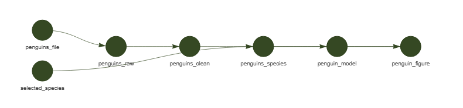
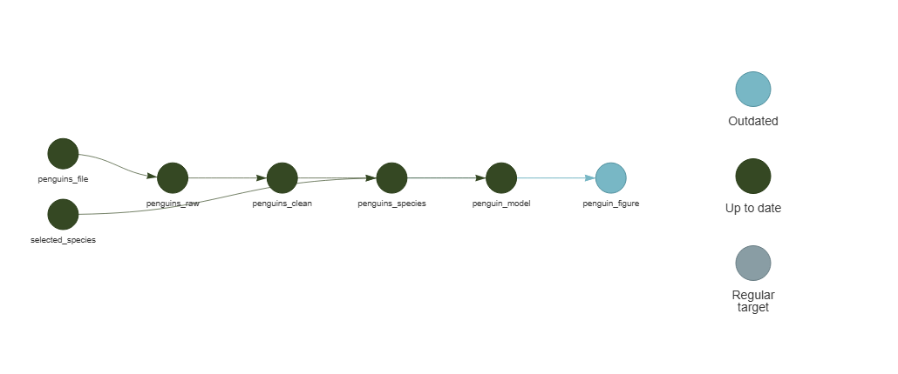
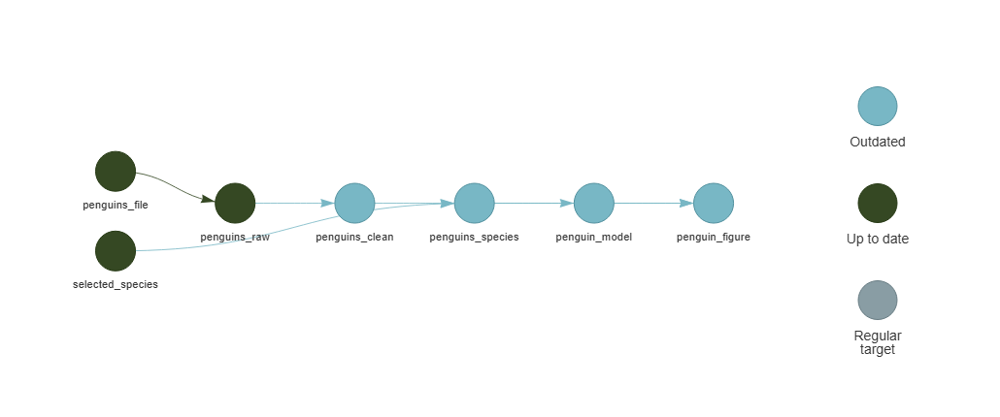
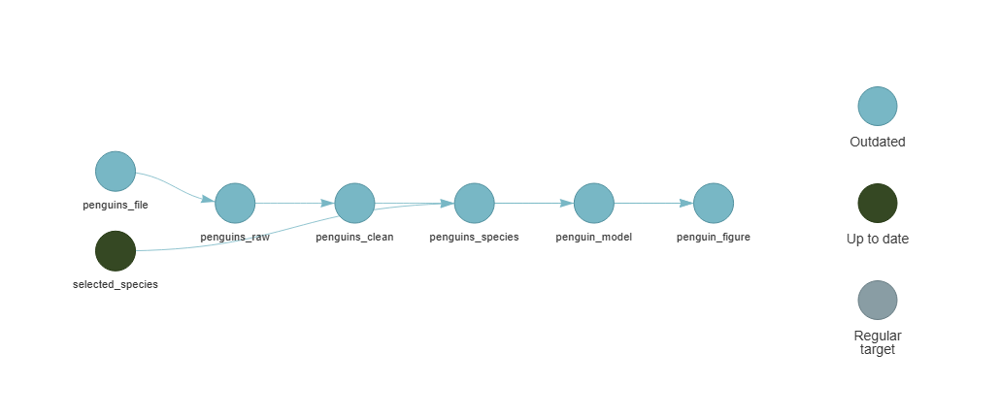

```{r}
#| label: setup
#| include: false
options(htmltools.dir.version = FALSE)

knitr::opts_chunk$set(
  fig.width = 7,
  fig.height = 5,
  fig.align = "center",
  out.width = "100%"
)

here::i_am("Presentation/presentation.qmd")
knitr::opts_knit$set(root.dir = here::here())
source(here::here("R/set_r_theme.R"))

include_local_figure <- function(data_source) {
  knitr::include_graphics(
    path = here::here("Presentation/Materials", data_source),
    error = TRUE
  )
}

project_name <- basename(here::here())
display_name <- project_name |>
  sub(pattern = "^SSoQE-", replacement = "") |>
  gsub(pattern = "_", replacement = " ") |>
  tools::toTitleCase()
github_url <- paste0("https://github.com/SSoQE/", project_name)
slides_url <- paste0("https://ssoqe.github.io/", project_name, "/")
```

# {.title}

<!-- 1 -->

<br>

:::: {.columns}

::: {.column width="80%"}
:::

::: {.column width="20%"}

```{r}
#| label: title-logo
#| fig-alt: "Science School on Quantitative Ecology logo."
include_local_figure("Logos/SSOQE_logo3.png")
```

:::

::::

:::: {.r-hstack}
::: {data-id="box1" style="background: `r ssoqe_cols['black']`; width: 135px; height: 15px; margin: 0px;"}
:::

::: {data-id="box2" style="background: `r ssoqe_cols['cambridge_blue']`; width: 405px; height: 15px; margin: 0px;"}
:::

::: {data-id="box3" style="background: `r ssoqe_cols['persian_green']`; width: 225px; height: 15px; margin: 0px;"}
:::

::: {data-id="box4" style="background: `r ssoqe_cols['satin_sheen_gold']`; width: 135px; height: 15px; margin: 0px;"}
:::
::::

::: {.text-color-white .text-font-heading .text-size-heading2 .text-bold}
`r display_name`
:::

:::: {.columns}

::: {.column width="20%"}
:::

::: {.column width="80%" .text-right .text-size-body}
[👤](https://ondrejmottl.github.io/) Ondřej Mottl

[Science School on Quantitative Ecology 2026]{.text-color-white}

[bit.ly/SSoQE](https://bit.ly/SSoQE){.text-color-black}
:::

::::

::: {.notes}
Timing: 0:00 to 1:00. Welcome participants and frame the lesson around a practical problem: keeping results aligned with changing code and data. The complete slides, exercise guide, data, functions, and checkpoints live in the linked repository.
:::
<!-- 2 -->
## Reproducible analytical pipeline

<br>

::: {.text-center}
{fig-alt="Illustrated overview of a reproducible research workflow, from inputs and methods to computational steps and outputs." width="72%" .nostretch}
:::

::: footer
[Illustration: Scriberia for The Turing Way, CC BY 4.0](https://zenodo.org/records/3332807)
:::

::: {.notes}
Timing: 1:00 to 3:00. Give participants time to inspect the full workflow. Ask where their own analysis code, input data, intermediate results, and final outputs would appear. Explain that this lesson focuses on making the computational connections explicit.
:::

<!-- 3 -->
## What we'll cover today

<br>

:::: {.columns}

::: {.column width="46%" .incremental}

### 🎯 **Main topics**

- Dependencies in an analysis
- A `{targets}` project
- Selective rebuilding
- Debugging and extension

:::

::: {.column width="54%" .incremental}

### ✅ **By the end, you'll be able to:**

- Create a `{targets}` project in RStudio
- Turn prepared functions into a pipeline
- Inspect, build, and retrieve targets
- Predict what becomes outdated after a change
- Add a new target to an existing pipeline

:::

::::

::: {.notes}
Timing: 3:00 to 5:00. Introduce the progression from dependencies to a working pipeline and then controlled change. Participants do not need to memorise the package today. They need a working mental model, a successful first pipeline, and reliable places to continue learning.
:::
<!-- 4 -->
## A classic multi-script project {.smaller}

<br>

:::: {.columns}

::: {.column width="52%"}

```text
.
├─ Data/
│  ├─ Input/penguins.csv
│  └─ Processed/
│     ├─ penguins.rds
│     └─ model.rds
├─ R/
│  ├─ 00_master.R
│  ├─ 01_prepare_data.R
│  ├─ 02_fit_model.R
│  └─ 03_plot_results.R
└─ Outputs/penguin_figure.png
```

:::

::: {.column width="42%" .fragment}

### `00_master.R`

```r
source("R/01_prepare_data.R")
source("R/02_fit_model.R")
source("R/03_plot_results.R")
```

The master script remembers the order.

:::

::::

::: {.fragment .blockquote}
Which stored results are outdated after one function changes?
:::

::: {.notes}
Timing: 5:00 to 7:00. Start with a familiar project: numbered scripts, saved intermediate files, and a master script. The master script records one complete run order, but it cannot inspect the code and decide which stored results remain current. Let participants answer the question before moving on.
:::

<!-- 5 -->
## Three scripts, one analysis {.smaller}

:::: {.columns}

::: {.column width="32%"}

### 1. Prepare

```r
# 01_prepare_data.R
penguins_species <-
  read_penguins(
    here::here(
      "Data", "Input",
      "penguins.csv"
    )
  ) |>
  clean_penguins() |>
  filter_penguins("Adelie")

readr::write_rds(
  penguins_species,
  here::here(
    "Data", "Processed",
    "penguins.rds"
  )
)
```

:::

::: {.column width="32%" .fragment}

### 2. Model

```r
# 02_fit_model.R
penguins_species <-
  readr::read_rds(
    here::here(
      "Data", "Processed",
      "penguins.rds"
    )
  )

penguin_model <-
  fit_penguin_model(
    penguins_species
  )

readr::write_rds(
  penguin_model,
  here::here(
    "Data", "Processed",
    "model.rds"
  )
)
```

:::

::: {.column width="32%" .fragment}

### 3. Plot

```r
# 03_plot_results.R
penguins_species <-
  readr::read_rds(
    here::here(
      "Data", "Processed",
      "penguins.rds"
    )
  )
penguin_model <-
  readr::read_rds(
    here::here(
      "Data", "Processed",
      "model.rds"
    )
  )

penguin_figure <-
  plot_penguin_model(
    penguins_species,
    penguin_model
  )

ggplot2::ggsave(
  here::here(
    "Outputs",
    "penguin_figure.png"
  ),
  penguin_figure
)
```

:::

::::

::: {.notes}
Timing: 7:00 to 11:00. Reveal one complete script at a time. Follow the objects across the file boundaries: the first script writes data, the second reads those data and writes a model, and the third reads both. These scripts work, but the analyst must maintain every read, write, filename, and execution decision.
:::
<!-- 6 -->
## `{targets}`

<br>

:::: {.columns}

::: {.column width="52%"}

```{r}
#| label: targets-logo
#| fig-alt: "Hexagonal logo of the targets R package."
include_local_figure("Logos/targets-logo.svg")
```

:::

::: {.column width="42%" .incremental}

The package records:

- the command for each result,
- dependencies between results,
- which results are already current.

:::

::::

::: footer
[Official targets documentation](https://docs.ropensci.org/targets/)
:::

::: {.notes}
Timing: 11:00 to 12:00. Keep the package introduction brief. The next four slides show the same analysis as targets, execute it, inspect the graph, and retrieve the result.
:::

<!-- 7 -->
## The same analysis as three targets {.smaller}

:::: {.columns}

::: {.column width="34%"}

### 1. Prepare

```r
targets::tar_target(
  penguins_species,
  read_penguins(
    "Data/Input/penguins.csv"
  ) |>
    clean_penguins() |>
    filter_penguins("Adelie")
)
```

:::

::: {.column width="30%" .fragment}

### 2. Model

```r
targets::tar_target(
  penguin_model,
  fit_penguin_model(
    penguins_species
  )
)
```

:::

::: {.column width="34%" .fragment}

### 3. Plot

```r
targets::tar_target(
  penguin_figure,
  plot_penguin_model(
    penguins_species,
    penguin_model
  )
)
```

:::

::::

::: {.fragment .blockquote}
Each target returns one value. Using another target's name in the command creates a dependency.
:::

::: {.notes}
Timing: 12:00 to 16:00. Keep each target in the same position as its script on the previous slide. The first target replaces the first script and returns the prepared data. The second and third commands refer to upstream target names, which creates the dependencies. The complete definitions used for this demonstration live in R/Presentation/targets_demo.R.
:::

<!-- 8 -->
## Run the pipeline {.smaller}

```{r}
#| label: prepare-targets-demo
#| include: false
demo_store <- tempfile(pattern = "targets-lecture-")
demo_script <- here::here("R/Presentation/targets_demo.R")

run_demo_pipeline <- function() {
  start_marker <- "__TARGETS_OUTPUT_START__"
  end_marker <- "__TARGETS_OUTPUT_END__"
  child_script <- tempfile(fileext = ".R")
  reporter_file <- tempfile(fileext = ".txt")
  on.exit(unlink(c(child_script, reporter_file)), add = TRUE)

  command <- paste0(
    "suppressWarnings(targets::tar_make(",
    "script = ", encodeString(demo_script, quote = "\""), ", ",
    "store = ", encodeString(demo_store, quote = "\""), ", ",
    "reporter = 'verbose', callr_function = NULL))"
  )
  writeLines(
    c(
      paste0(".libPaths(", paste(deparse(.libPaths()), collapse = ""), ")"),
      paste0("setwd(", encodeString(here::here(), quote = "\""), ")"),
      paste0("cat('", start_marker, "\\n')"),
      command,
      paste0("cat('", end_marker, "\\n')")
    ),
    child_script
  )
  status <- system2(
    command = file.path(R.home("bin"), "Rscript.exe"),
    args = c("--vanilla", shQuote(child_script)),
    stdout = reporter_file,
    stderr = reporter_file
  )
  if (!identical(status, 0L)) {
    stop("The targets demonstration process failed.", call. = FALSE)
  }

  output <- readLines(reporter_file, warn = FALSE)
  start <- match(start_marker, output)
  end <- match(end_marker, output)
  if (is.na(start) || is.na(end) || end <= start) {
    stop("Could not capture the targets reporter output.", call. = FALSE)
  }
  output[seq.int(start + 1L, end - 1L)]
}

demo_first_output <- run_demo_pipeline()
demo_second_output <- run_demo_pipeline()
```

:::: {.columns}

::: {.column width="55%"}

### First run

```r
targets::tar_make(
  reporter = "verbose"
)
```

```{r}
#| label: show-first-targets-run
#| echo: false
cat(demo_first_output, sep = "\n")
```

:::

::: {.column width="42%" .fragment}

### Second run

```r
targets::tar_make(
  reporter = "verbose"
)
```

```{r}
#| label: show-second-targets-run
#| echo: false
cat(demo_second_output, sep = "\n")
```

:::

::::

::: {.fragment .blockquote}
Nothing changed, so every target was skipped.
:::

::: {.notes}
Timing: 16:00 to 18:00. The pipeline executes during rendering. The output blocks contain the literal reporter stream from the two tar_make() calls executed during rendering, not reconstructed status tables. The verbose reporter makes every dispatched and completed target visible. All three targets complete on the first run. The second run skips the pipeline because the commands and dependencies are unchanged.
:::
<!-- 9 -->
## Inspect the pipeline {.smaller}

:::: {.columns}

::: {.column width="22%"}

```r
targets::tar_visnetwork(
  targets_only = TRUE
)
```

The arrows come from target names used inside commands.

:::

::: {.column width="75%"}

```{r}
#| label: show-demo-network
#| echo: false
#| warning: false
#| message: false
#| out-height: "440px"
demo_network <- suppressWarnings(
  targets::tar_visnetwork(
    targets_only = TRUE,
    script = demo_script,
    store = demo_store,
    reporter = "silent",
    callr_function = NULL
  )
) |>
 visNetwork::visNodes(
    size = 30,
    font = list(size = 20)
  ) |>
  visNetwork::visEdges(
    width = 2,
    arrows = "to",
    smooth = list(
      enabled = TRUE,
      type = "curvedCW",
      roundness = 0.18
    )
  ) |>
  visNetwork::visHierarchicalLayout(
    levelSeparation = 230,
    direction = "LR"
  )

demo_network$x$legend <- NULL
demo_network
```

:::

::::

::: {.notes}
Timing: 18:00 to 20:00. This is the live tar_visnetwork output from the pipeline that just ran. Trace penguins_species into the model and figure, then trace the model into the figure. All three nodes are current after tar_make().
:::

<!-- 10 -->
## Read a result {.smaller}

:::: {.columns}

::: {.column width="30%"}

```r
targets::tar_read(
  penguin_figure
)
```

`tar_read()` retrieves the stored return value by name.

:::

::: {.column width="66%"}

```{r}
#| label: show-demo-figure
#| echo: false
#| fig-alt: "Adelie penguin bill length plotted against bill depth with the fitted linear relationship."
#| fig-width: 6
#| fig-height: 4.2
#| out-width: "100%"
targets::tar_read_raw(
  name = "penguin_figure",
  store = demo_store
)
```

:::

::::

::: {.fragment .blockquote}
The pipeline ran, the graph records why, and the result is ready to use.
:::

::: {.notes}
Timing: 20:00 to 22:00. This plot is the actual penguin_figure target created on slide 8. Keep the distinction clear: tar_make() updates the pipeline, tar_visnetwork() displays its state, and tar_read() retrieves an object for interactive use.
:::
<!-- 11 -->
## A separate project for the exercises {.smaller}

:::: {.columns}

::: {.column width="57%"}

1. In RStudio: **File > New Project > New Directory > New Project**.
2. Name it `targets-penguins` and create it outside the lecture repository.
3. Inspect the raw [`setup_exercise.R`](https://raw.githubusercontent.com/SSoQE/SSoQE-Reproducible_Analytical_Pipelines/main/setup_exercise.R), then run:

```r
source(paste0(
  "https://raw.githubusercontent.com/",
  "SSoQE/SSoQE-Reproducible_Analytical_",
  "Pipelines/main/setup_exercise.R"
))
```

:::

::: {.column width="39%" .fragment}

One 32 KB request creates and verifies:

- `Data/Input/penguins.csv`
- seven files in `R/Functions/`
- `Checkpoints/` and `Solutions/`

```r
targets::use_targets()
```

This separate command creates `_targets.R`.

:::

::::

::: {.notes}
Timing: 22:00 to 23:00. Demonstrate the complete sequence in a disposable directory. Start with a blank RStudio Project and open the raw bootstrap link so participants can inspect the code. The single small request writes the local data, seven editable functions, checkpoints, and solutions. Point to those files before running use_targets(), which separately creates the pipeline infrastructure.
:::
<!-- 12 -->
## Inside generated `_targets.R` {.smaller}

:::: {.columns}

::: {.column width="49%"}
```r
library(targets)

tar_option_set(
  packages = c("tibble")
)

tar_source()

list(
  tar_target(
    data,
    tibble(
      x = rnorm(100),
      y = rnorm(100)
    )
  ),
  tar_target(
    model,
    coefficients(lm(y ~ x, data = data))
  )
)
```
:::

::: {.column width="26%" .fragment}

1. Load the pipeline infrastructure.
2. Set options shared by targets.
3. Source the prepared functions.
4. Return the target list.

:::

::::

::: {.notes}
Timing: 23:00 to 24:00. This slide matches targets 1.12.0. Identify the four regions. The bootstrapped project contains only reusable function files under R/, so the generated tar_source() call is safe. Exercise 2 will narrow it to R/Functions to make the intended source explicit.
:::

<!-- 13 -->
## [Exercise 1, stage 1: get the prepared files]{.text-size-heading2} {.exercise .text-center .smaller}

::: {.blockquote .text-left}

**Work individually or with a neighbour.**

1. Create a new project named `targets-penguins`.
2. Inspect the raw [`setup_exercise.R`](https://raw.githubusercontent.com/SSoQE/SSoQE-Reproducible_Analytical_Pipelines/main/setup_exercise.R).
3. Run the one-request bootstrap:

```r
source(paste0(
  "https://raw.githubusercontent.com/SSoQE/",
  "SSoQE-Reproducible_Analytical_Pipelines/main/setup_exercise.R"
))
```

4. Check the local files:

```r
list.files("R/Functions")
file.exists("Data/Input/penguins.csv")
```

**Success:** seven function files appear and the file check returns `TRUE`.

:::

`r countdown::countdown(minutes = 4)`

::: {.notes}
Timing: 24:00 to 28:00. Participants work individually or with a neighbour. Before they run the bootstrap, confirm that RStudio shows targets-penguins as the active project. The script uses one small request, refuses to overwrite files, and verifies every local copy. Do not run use_targets() yet.
:::
<!-- 14 -->
## [Exercise 1, stage 2: create and inspect]{.text-size-heading2} {.exercise .text-center .smaller}

::: {.blockquote .text-left}

1. Create the default target script:

```r
targets::use_targets()
```

2. Open `_targets.R` and find its four regions.
3. Inspect the pipeline:

```r
targets::tar_manifest()
```

**Success:** `_targets.R` exists and the manifest contains `data` and `model`.

**If you are stuck:** copy the local `Checkpoints/01_default_targets.R` to `_targets.R`.

:::

`r countdown::countdown(minutes = 3)`

::: {.notes}
Timing: 28:00 to 31:00. Keep use_targets() and tar_manifest() as two distinct actions. Help participants find the generated file before they run the inspection command. The checkpoint is already local because the bootstrap created it in stage 1, so recovery requires no additional internet request.
:::
<!-- 15 -->
## Exercise 1 debrief {.smaller}

:::: {.columns}

::: {.column width="52%"}

```text
#> # A tibble: 2 × 2
#>   name  command
#>   <chr> <chr>
#> 1 data  tibble(...)
#> 2 model coefficients(lm(..., data = data))
```

:::

::: {.column width="38%"}

```{mermaid}
flowchart LR
  D[data] --> M[model]
```

Mentioning `data` creates the edge.

:::

::::

::: {.notes}
Timing: 31:00 to 32:00. Read the two-row manifest, then trace the rendered network. Confirm that target order in the list is not the dependency mechanism. The reference to data inside the model command creates the edge.
:::

<!-- 16 -->
## The bootstrap created these pieces {.smaller}

```text
targets-penguins/
├─ Checkpoints/
├─ Data/
│  └─ Input/penguins.csv
├─ R/
│  └─ Functions/
│     ├─ read_penguins.R
│     ├─ clean_penguins.R
│     ├─ filter_penguins.R
│     ├─ fit_penguin_model.R
│     ├─ plot_penguin_model.R
│     ├─ summarise_penguins.R
│     └─ split_penguins.R
├─ Solutions/
└─ _targets.R
```

::: {.fragment .blockquote}
These are local, editable files. Exercise 2 needs no further download.
:::

::: {.notes}
Timing: 32:00 to 34:00. Connect this slide explicitly to Exercise 1: setup_exercise.R wrote the data, functions, checkpoints, and solutions into the new project. use_targets() added only _targets.R. Open one function file if helpful. Exercise 2 now connects these prepared local pieces into a pipeline.
:::
<!-- 17 -->
## Functions and packages

```r

targets::tar_source("R/Functions")

targets::tar_option_set(
  packages = c(
    "dplyr",
    "ggplot2",
    "readr",
    "tidyr"
  )
)
```

::: {.fragment}

`tar_source()`: load project functions.

`tar_option_set()`: declare packages for target processes.

:::

::: footer
[`tar_source()` reference](https://docs.ropensci.org/targets/reference/tar_source.html)
:::

::: {.notes}
Timing: 34:00 to 36:00. Explain why clicking Source in RStudio does not count: the pipeline must load everything it needs in a fresh process.
:::

<!-- 18 -->
## A tracked file

```r

targets::tar_target(
  penguins_file,
  "Data/Input/penguins.csv",
  format = "file"
)
```

:::: {.columns .fragment}
::: {.column width="40%"}

Without `format = "file"`

Tracks only the path.

:::
::: {.column width="3%"}
:::
::: {.column width="40%"}

With `format = "file"`

Tracks the file contents.

:::
::::

::: footer
[Files in targets](https://books.ropensci.org/targets/data.html)
:::

::: {.notes}
Timing: 36:00 to 38:00. Ask what happens if a colleague replaces the CSV with a new version. The file target makes that change visible to the pipeline.
:::

<!-- 19 -->
## Data targets

```r

targets::tar_target(
  penguins_raw,
  read_penguins(penguins_file)
),
targets::tar_target(
  penguins_clean,
  clean_penguins(penguins_raw)
),
```

```{mermaid}
flowchart LR
  F[penguins_file] --> R[penguins_raw] --> C[penguins_clean]
```

::: {.notes}
Timing: 38:00 to 40:00. Reveal one target at a time. Ask which symbol in each command connects it to the previous target.
:::

<!-- 20 -->
## Analysis targets

```r

targets::tar_target(selected_species, "Adelie"),
targets::tar_target(
  penguins_species,
  filter_penguins(penguins_clean, selected_species)
),
targets::tar_target(
  penguin_model,
  fit_penguin_model(penguins_species)
),
targets::tar_target(
  penguin_figure,
  plot_penguin_model(penguins_species, penguin_model)
),
```

::: {.notes}
Timing: 40:00 to 42:00. Point out that `selected_species` is data too. Making it a target means targets can detect a change from Adelie to Gentoo.
:::

<!-- 21 -->
## Pipeline inspection {.smaller}

:::: {.columns}

::: {.column width="35%"}

```r

targets::tar_manifest()
```

Read every command.

```r

targets::tar_visnetwork()
```

Check every edge.

:::

::: {.column width="58%"}

```{mermaid}
flowchart TB
  F[penguins_file] --> R[penguins_raw]
  R --> C[penguins_clean]
  C --> D[penguins_species]
  S[selected_species] --> D
  D --> M[penguin_model]
  D --> P[penguin_figure]
  M --> P
```

:::

::::

::: {.notes}
Timing: 42:00 to 43:00. Keep the network visible from the first state. Establish the habit of inspecting structure before spending time on a build. Compare every arrow with the object names used inside target commands.
:::

<!-- 22 -->
## [Exercise 2: build and run]{.text-size-heading2} {.exercise .text-center .smaller}

::: {.blockquote .text-left}

**With a partner.**

1. Replace the generated example.
2. Source `R/Functions` and declare packages.
3. Add the seven targets shown below.
4. Inspect with `tar_manifest()` and `tar_visnetwork()`.
5. Run twice, then read `penguin_figure`.

:::

::: {.text-center}
{fig-alt="The real tar_visnetwork output for the completed seven-target penguin pipeline. The tracked file and selected species feed the data, model, and figure targets; all targets are up to date." width="94%" .nostretch}
:::

::: {.text-center .smaller}
Expected `tar_visnetwork()` result after a successful build · dark green = up to date
:::

::: {.notes}
Timing: 43:00 to 45:00. Use the real tar_visnetwork output as the specification for the exercise. Ask participants to point from each node to the matching tar_target() block in the handout. Explain that the dark green nodes show the successful post-build state. The handout contains every code block, so participants should paste short blocks and explain dependencies rather than transcribe long code.
:::
<!-- 23 -->
## [Exercise 2: support]{.text-size-heading2} {.exercise .text-center .smaller}

<br>

::: {.blockquote .text-left}

**Success**

- The graph contains seven targets.
- The first `tar_make()` builds them.
- The second `tar_make()` skips them.
- `tar_read(penguin_figure)` shows an Adelie plot.

**Checkpoint:** [`Checkpoints/02_penguin_pipeline.R`](https://raw.githubusercontent.com/SSoQE/SSoQE-Reproducible_Analytical_Pipelines/main/Exercise_project_starter/Checkpoints/02_penguin_pipeline.R)

:::

`r countdown::countdown(minutes = 11)`

::: {.notes}
Timing: 45:00 to 55:00. Pair participants. Check that commas sit between target definitions and all targets sit inside one list. Move anyone who is still blocked to Checkpoint 2 before the debrief.
:::
<!-- 24 -->
## Exercise 2 debrief

:::: {.columns}

::: {.column width="40%"}

### First run

```text
#> 7 completed
#> 0 skipped
```

Targets stores each returned value in `_targets/`.

:::

::: {.column width="3%"}
:::

::: {.column width="40%" .fragment}

### Second run

```text
#> skipped pipeline
#> 7 skipped
```

Current code, inputs, and stored values agree.

:::

::::

```{r}
#| label: pipeline-current-graph
#| fig-alt: "The seven-target penguin pipeline after a successful build, with all nodes up to date."
#| out-width: 80%
include_local_figure("Figures/pipeline-current-graph.png")
```

::: {.notes}
Timing: 55:00 to 56:00. Ask one participant to explain why the second run can skip safely. Point to the real tar_visnetwork output: every node is up to date. Mention that `_targets/` is a cache and metadata store, not a folder to edit by hand.
:::

<!-- 25 -->
## A plot function changes

```r

ggplot2::geom_point(
  shape = 19,
  size = 2.2,
  alpha = 0.75
)
```

::: {.fragment}
```r

ggplot2::geom_point(
  shape = 17,
  size = 2.2,
  alpha = 0.75
)
```
:::

::: {.fragment .blockquote}
Which targets are now outdated?
:::

::: {.notes}
Timing: 56:00 to 58:00. Do not reveal the answer yet. Let participants point to nodes in the graph or discuss with a neighbour.
:::

<!-- 26 -->
## The graph marks work to update {.smaller}

```r

targets::tar_visnetwork()
```

::: {.text-center}
{fig-alt="A targets network after the plotting function changes. Only penguin_figure is blue, meaning outdated; all upstream targets are dark green and up to date." style="height: 320px !important; width: auto !important;"}
:::

::: {.fragment .text-center}
For names only: `tar_outdated()` returns `"penguin_figure"`.
:::

::: {.notes}
Timing: 58:00 to 60:00. Read the real tar_visnetwork state directly: blue means outdated and dark green means up to date. Only the figure needs work. Its upstream targets remain valid because neither their values nor the code that produced them changed. After tar_make(), the figure returns to dark green.
:::

<!-- 27 -->
## A cleaning function changes {.smaller}

Which targets become outdated?

::: {.fragment}
```r

targets::tar_visnetwork()
```

::: {.text-center}
{fig-alt="A targets network after the cleaning function changes. The clean data, species data, model, and figure are blue and outdated; the file, raw data, and selected species are dark green and up to date." style="height: 320px !important; width: auto !important;"}
:::
:::

::: {.notes}
Timing: 60:00 to 62:00. Ask participants to predict before advancing. Then read the actual tar_visnetwork state from left to right. The cleaned data and every downstream result are outdated. The file, raw data, and independent species choice remain current.
:::

<!-- 28 -->
## An input file changes {.smaller}

Which targets become outdated?

::: {.fragment}
```r

targets::tar_visnetwork()
```

::: {.text-center}
{fig-alt="A targets network after the tracked CSV changes. The file, raw data, clean data, species data, model, and figure are blue and outdated; selected_species is dark green and up to date." style="height: 320px !important; width: auto !important;"}
:::
:::

::: {.fragment .text-center}
`selected_species` stays current: it does not depend on the CSV.
:::

::: {.notes}
Timing: 62:00 to 65:00. Ask for a prediction before advancing. Then read the actual tar_visnetwork state. The tracked file and every dependent target are outdated. The independent species choice remains current, although its downstream consumer must rebuild because the cleaned data changed.
:::
<!-- 29 -->
## A target fails

```text
#> + penguin_model dispatched
#> ✖ penguin_model errored
#> ✖ errored pipeline
#> Error: object 'bill_depth_mm' not found
```

::: {.fragment .blockquote}
The completed upstream targets stay in the cache.
:::

::: {.notes}
Timing: 65:00 to 67:00. Explain that failure does not erase successful work. The pipeline stops because the downstream result cannot be trusted.
:::

<!-- 30 -->
## The recorded error

```r

targets::tar_meta(
  fields = error,
  complete_only = TRUE
)
```

```text
#> # A tibble: 1 × 2
#>   name           error
#>   <chr>          <chr>
#> 1 penguin_model  object 'bill_depth_mm' not found
```

::: footer
[Official debugging guide](https://books.ropensci.org/targets/debugging.html)
:::

::: {.notes}
Timing: 67:00 to 69:00. Show that metadata answers “where did it fail?” It may already provide enough information to inspect the responsible function.
:::

<!-- 31 -->
## Interactive debugging

```r

targets::tar_load_globals()
targets::tar_load(penguins_species)

fit_penguin_model(penguins_species)
```

::: {.fragment}

1. Reproduce the error outside the pipeline.
2. Fix the function.
3. Run `tar_make()` again.

:::

::: {.notes}
Timing: 69:00 to 71:00. Present this as a survival routine, not a complete debugging course. The function call should fail in the ordinary interactive environment, where familiar tools are available.
:::

<!-- 32 -->
## [Exercise 3: change and extend]{.text-size-heading2} {.exercise .text-center .smaller}

<br>

::: {.blockquote .text-left}

**With a partner.**

1. Change the point shape.
2. Write down your prediction, then run `tar_outdated()`.
3. Rebuild and confirm that upstream targets skip.
4. Add `penguin_summary`.
5. Inspect, build, and read the new target.

:::

::: {.notes}
Timing: 71:00 to 73:00. Ask participants to write down their outdated prediction before running the command. The handout provides the exact new target definition.
:::
<!-- 33 -->
## [Exercise 3: support]{.text-size-heading2} {.exercise .text-center .smaller}

<br>

::: {.blockquote .text-left}

**Success**

- Your outdated set matches your written prediction.
- The graph contains `penguin_summary`.
- `tar_read(penguin_summary)` returns a table.
- A final `tar_make()` skips all work.

**Checkpoint:** `Checkpoints/03_extended_pipeline.R`

:::

`r countdown::countdown(minutes = 10)`

::: {.notes}
Timing: 73:00 to 82:00. Ask early finishers to change `clean_penguins()` and predict the wider outdated set before checking it. Move blocked participants to Checkpoint 3 before the timer ends. Keep the exact dependency answer for the debrief.
:::
<!-- 34 -->
## Exercise 3 debrief {.smaller}

```{mermaid}
flowchart TB
  F[file] --> R[raw] --> C[clean] --> D[data]
  S[species] --> D --> M[model]
  D --> P[figure]
  M --> P
  D --> A[new summary]
  style A fill:#A1C3B3,color:#1F2937
```

:::: {.columns .fragment}
::: {.column width="26%"}
**Skipped:** current upstream work
:::
::: {.column width="26%"}
**Rebuilt:** changed figure
:::
::: {.column width="26%"}
**Built:** new summary
:::
::::

::: {.notes}
Timing: 82:00 to 84:00. Ask pairs to explain one status each. Reinforce that the graph, not the physical order of code, determines the schedule.
:::

<!-- 35 -->
## One analysis per species

A list can hold one dataset per species:

```r

penguins_by_species <-
  split_penguins(penguins_clean)
```

::: {.fragment}

`targets` can create one model target for each list element:

```r

targets::tar_target(
  penguin_model,
  fit_penguin_model(penguins_by_species),
  pattern = map(penguins_by_species),
  iteration = "list"
)
```

:::

::: {.notes}
Timing: 84:00 to 85:30. Introduce split data as the input to repeated analyses. Clarify that `map()` here describes a targets branching pattern. It is not a call to `purrr::map()`.
:::

<!-- 36 -->
## Dynamic branches {.smaller}

```{mermaid}
flowchart TB
  C[penguins_clean] --> B[penguins_by_species]
  B --> A[Adelie model]
  B --> H[Chinstrap model]
  B --> G[Gentoo model]
  A --> AP[Adelie figure]
  H --> HP[Chinstrap figure]
  G --> GP[Gentoo figure]
```

::: {.fragment .blockquote}
Branches can run independently and in parallel with workers.
:::

::: footer
[Dynamic branching chapter](https://books.ropensci.org/targets/dynamic.html)
:::

::: {.notes}
Timing: 85:30 to 87:00. Keep this as a preview. Show the completed local example path, `Solutions/branching_preview.R`, and defer worker configuration to self-study.
:::

<!-- 37 -->
## Start again tomorrow {.smaller}

:::: {.columns}

::: {.column width="40%"}

### 4 minutes

[Official video and example project](https://docs.ropensci.org/targets/#get-started-in-4-minutes)

Replay the basic lifecycle.

### One tutorial

[Official walkthrough](https://books.ropensci.org/targets/walkthrough.html)

Build another small pipeline carefully.

:::

::: {.column width="3%"}
:::

::: {.column width="40%"}

### One complete course

[Carpentries Incubator workshop](https://carpentries-incubator.github.io/targets-workshop/)

Guided practice from setup to reports. The lesson currently has pre-alpha status.

### The bigger picture

[Reproducible analytical pipelines with R](https://raps-with-r.dev/targets.html)

Connect targets with functions, tests, environments, and reports.

:::

::::

::: {.notes}
Timing: 87:00 to 88:30. Give participants a specific next action rather than asking them to read everything. Recommend the four-minute example first, then the walkthrough.
:::

<!-- 38 -->
## Where do I look? {.smaller}

| My question | Best starting point |
|---|---|
| Function arguments? | [Function reference](https://docs.ropensci.org/targets/reference/index.html) |
| Pipeline failed? | [Debugging guide](https://books.ropensci.org/targets/debugging.html) |
| Ask for help? | [Help guide](https://books.ropensci.org/targets/help.html) |
| Repeat an analysis? | [Dynamic branching](https://books.ropensci.org/targets/dynamic.html) |
| Render a Quarto report? | [Reports chapter](https://books.ropensci.org/targets/literate-programming.html) |
| Extension packages? | [R Targetopia](https://wlandau.github.io/targetopia/) |

::: {.notes}
Timing: 88:30 to 90:00. Ask participants to choose the row that matches their next question. Point them to the longer resource map in the exercise handout and remind them that the completed local solution works offline.
:::
